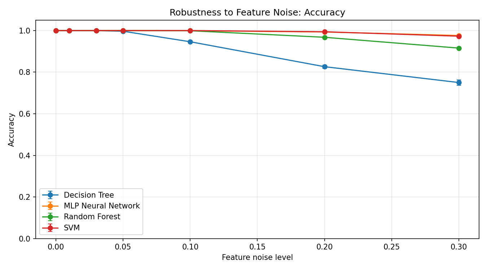
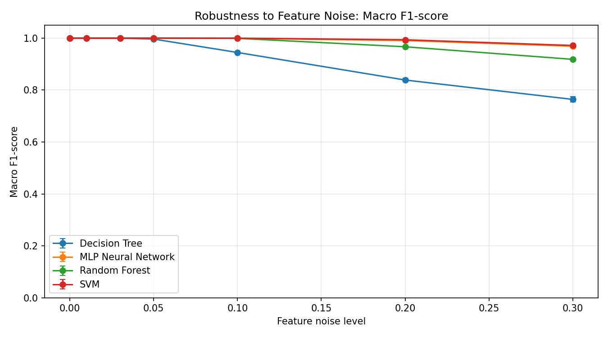
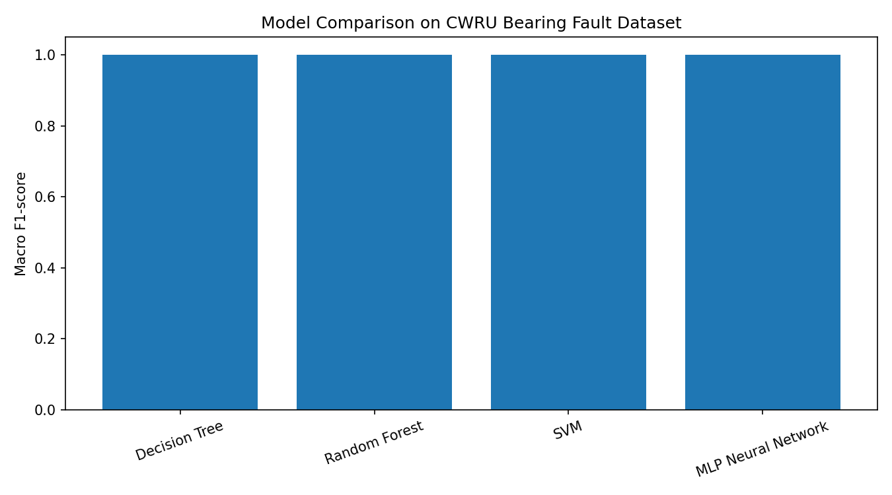
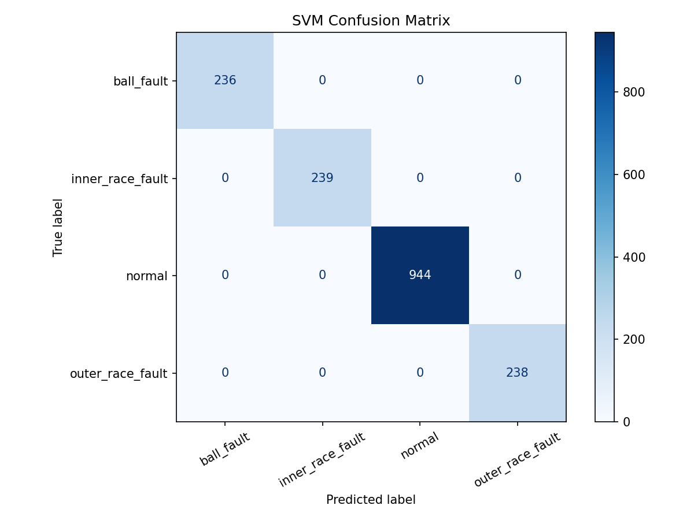
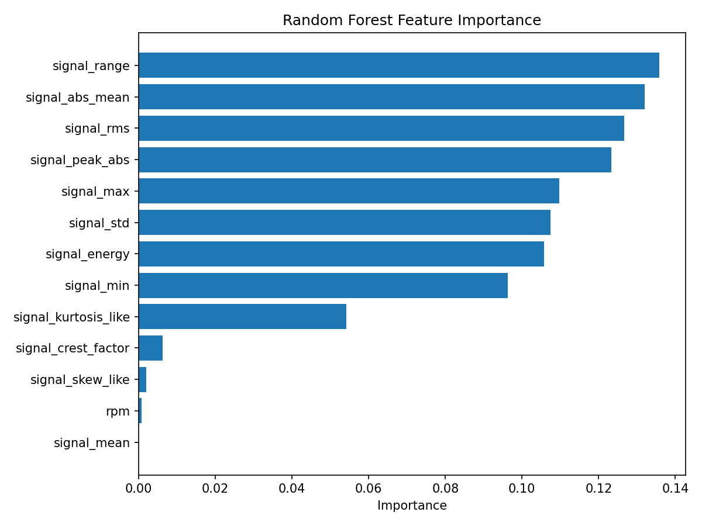

# Time-Series Motor Fault Detection

Machine learning project for bearing fault diagnosis using real vibration data from the Case Western Reserve University Bearing Data Center.

This project uses time-series vibration signals from a motor bearing test rig and compares multiple machine learning models, including a neural network, for fault classification. It also includes a robustness analysis to evaluate how trained models behave when engineered test features are perturbed with noise.

The project connects:

- real vibration sensor data
- rotating machinery fault diagnosis
- time-series feature extraction
- supervised machine learning
- neural network baseline
- robustness analysis
- condition monitoring
- intelligent physical systems

---

## Project Overview

The goal of this project is to classify motor bearing conditions from vibration time-series data.

The project uses a subset of the CWRU Bearing Fault Dataset with four classes:

- `normal`
- `ball_fault`
- `inner_race_fault`
- `outer_race_fault`

The workflow is:

```text
CWRU .mat files
→ drive-end vibration signal extraction
→ fixed-size time-window segmentation
→ statistical feature extraction
→ file-level train/test split
→ model training and comparison
→ confusion matrices and feature importance analysis
→ robustness evaluation under feature noise
```

---

## Why This Project Matters

Many real industrial and cyber-physical systems depend on sensors to monitor the health of rotating machinery.

Bearing faults are important because they can indicate early mechanical degradation in motors, pumps, fans, and other rotating systems.

This project demonstrates how real vibration data can be converted into a machine-learning classification pipeline for condition monitoring.

The robustness analysis adds an additional practical perspective by testing how model performance changes when engineered test features are perturbed. This is important because real sensor systems may experience noise, measurement variation, environmental effects, or operating-condition changes.

It complements my other projects in:

- DC motor simulation
- Kalman filtering
- dynamic system classification
- embedded TinyML condition monitoring
- IoT digital twin pipelines

Together, these projects support the broader direction:

```text
AI / ML for intelligent physical and sensor-based systems
```

---

## Dataset

This project uses a subset of the CWRU Bearing Fault Dataset.

Dataset source:

```text
Case Western Reserve University Bearing Data Center
```

Official dataset page:

```text
https://engineering.case.edu/bearingdatacenter/download-data-file
```

Used data categories:

| Class | Source |
|---|---|
| `normal` | Normal baseline data |
| `ball_fault` | 12k drive-end ball fault, 0.007 inch |
| `inner_race_fault` | 12k drive-end inner race fault, 0.007 inch |
| `outer_race_fault` | 12k drive-end outer race fault, 0.007 inch, 6 o'clock |

The raw `.mat` files are stored locally under:

```text
data/raw/cwru/
```

Raw dataset files are not tracked in Git because they are external dataset files.

The processed feature dataset is tracked:

```text
data/processed/cwru_bearing_features.csv
```

Detailed dataset download and organization notes are available in [`docs/dataset.md`](docs/dataset.md).

---

## Raw Data Organization

The raw CWRU files are organized locally as:

```text
data/raw/cwru/
├── normal/
│   ├── 97.mat
│   ├── 98.mat
│   ├── 99.mat
│   └── 100.mat
├── ball_007/
│   ├── 118.mat
│   ├── 119.mat
│   ├── 120.mat
│   └── 121.mat
├── inner_race_007/
│   ├── 105.mat
│   ├── 106.mat
│   ├── 107.mat
│   └── 108.mat
└── outer_race_007/
    ├── 130.mat
    ├── 131.mat
    ├── 132.mat
    └── 133.mat
```

For each `.mat` file, the drive-end vibration signal key ending in `_DE_time` is extracted.

---

## Feature Extraction

The vibration signal is segmented into fixed-size windows.

Windowing settings:

| Parameter | Value |
|---|---:|
| Window size | 1024 samples |
| Step size | 512 samples |

For each window, the following statistical features are extracted:

- mean
- standard deviation
- minimum
- maximum
- range
- RMS
- energy
- absolute mean
- peak absolute value
- crest factor
- skew-like statistic
- kurtosis-like statistic
- RPM value when available

The processed dataset contains:

```text
6153 windows
19 columns including metadata, label, and extracted features
```

Class distribution:

| Label | Windows |
|---|---:|
| `normal` | 3310 |
| `outer_race_fault` | 949 |
| `inner_race_fault` | 948 |
| `ball_fault` | 946 |

---

## Models Compared

The project compares four supervised learning models:

- Decision Tree
- Random Forest
- SVM
- MLP Neural Network

The MLP is included as a neural-network baseline to compare against classical machine learning methods.

Model training script:

```text
src/train_models.py
```

The models use median imputation for missing RPM values. SVM and MLP also use feature scaling.

Generated model files are saved locally under:

```text
models/
```

Model artifacts are ignored by Git because they can be regenerated from the training script.

---

## Evaluation Strategy

The dataset is split by source file rather than by individual windows.

This avoids putting windows from the same `.mat` file into both train and test sets.

For each class, one source file is held out for testing:

```text
121.mat
108.mat
99.mat
133.mat
```

This gives a more realistic evaluation than random window-level splitting.

---

## Baseline Results

All models achieved perfect classification on the selected CWRU benchmark subset.

| Model | Accuracy | Macro F1 |
|---|---:|---:|
| Decision Tree | 1.0000 | 1.0000 |
| Random Forest | 1.0000 | 1.0000 |
| SVM | 1.0000 | 1.0000 |
| MLP Neural Network | 1.0000 | 1.0000 |

These results show that the selected CWRU subset is highly separable using the extracted statistical features.

However, this should be interpreted carefully. The dataset is a controlled benchmark subset, not a proof of general industrial reliability across all machines, operating conditions, and sensor placements.

---

## Robustness Analysis Under Feature Noise

To better understand model behavior beyond clean benchmark accuracy, this project includes a robustness experiment.

The models are trained on clean training features and then evaluated on perturbed test features. Gaussian noise is added to each engineered feature in proportion to the feature's standard deviation in the training set.

Noise levels tested:

```text
0.00, 0.01, 0.03, 0.05, 0.10, 0.20, 0.30
```

Each noise level is evaluated over 5 repeated random perturbations.

Robustness script:

```text
src/evaluate_robustness.py
```

Generated outputs:

```text
results/robustness_results.csv
results/robustness_accuracy_vs_noise.png
results/robustness_macro_f1_vs_noise.png
```

### Robustness Accuracy



### Robustness Macro F1-score



At higher feature-noise levels, the Decision Tree shows the largest performance drop, while SVM and MLP remain comparatively more stable. Random Forest also shows stronger robustness than the single Decision Tree.

This analysis makes the project more realistic by showing how different model families respond when the test data becomes less ideal.

Important note: this experiment perturbs engineered features, not the original raw vibration signal. It should be interpreted as a feature-level robustness test rather than a full sensor-domain shift experiment.

---

## Output Figures

### Model Comparison



### Decision Tree Confusion Matrix


### Random Forest Confusion Matrix


### SVM Confusion Matrix



### MLP Neural Network Confusion Matrix


### Random Forest Feature Importance



---

## Repository Structure

```text
time-series-motor-fault-detection/
├── data/
│   └── processed/
│       └── cwru_bearing_features.csv
├── docs/
│   └── dataset.md
├── results/
│   ├── confusion_matrix_decision_tree.png
│   ├── confusion_matrix_mlp_neural_network.png
│   ├── confusion_matrix_random_forest.png
│   ├── confusion_matrix_svm.png
│   ├── feature_importance_random_forest.png
│   ├── model_comparison.csv
│   ├── model_comparison.png
│   ├── robustness_accuracy_vs_noise.png
│   ├── robustness_macro_f1_vs_noise.png
│   └── robustness_results.csv
├── src/
│   ├── evaluate_robustness.py
│   ├── load_cwru_data.py
│   └── train_models.py
├── requirements.txt
├── .gitignore
├── LICENSE
└── README.md
```

---

## Main Files

Important files:

- `src/load_cwru_data.py`  
  Loads CWRU `.mat` files, extracts drive-end vibration windows, and builds the processed feature dataset.

- `src/train_models.py`  
  Trains and compares Decision Tree, Random Forest, SVM, and MLP Neural Network models.

- `src/evaluate_robustness.py`  
  Evaluates trained model families under feature-level noise perturbations and generates robustness plots.

- `data/processed/cwru_bearing_features.csv`  
  Processed feature dataset.

- `docs/dataset.md`  
  Dataset download, subset, and organization notes.

- `results/model_comparison.csv`  
  Model comparison table for the clean benchmark split.

- `results/robustness_results.csv`  
  Robustness results across feature-noise levels.

- `results/`  
  Confusion matrices, model comparison plots, feature importance, and robustness plots.

---

## How to Run

Create and activate a virtual environment:

```bash
python3 -m venv venv
source venv/bin/activate
```

Install dependencies:

```bash
pip install -r requirements.txt
```

Prepare the processed dataset from local raw CWRU files:

```bash
python src/load_cwru_data.py
```

Train and compare models:

```bash
python src/train_models.py
```

Run robustness analysis:

```bash
python src/evaluate_robustness.py
```

---

## Dependencies

Main libraries:

- `numpy`
- `pandas`
- `scipy`
- `matplotlib`
- `scikit-learn`
- `joblib`

---

## Project Role in Portfolio

This project provides a real-dataset machine learning example for fault diagnosis and condition monitoring.

It is especially useful because it includes:

- real benchmark vibration data
- time-series windowing
- feature extraction
- model comparison
- neural network baseline
- robustness analysis
- clear evaluation plots

It strengthens the AI/ML side of a portfolio focused on intelligent physical systems.

---

## Limitations

This project has several limitations:

- only a subset of the CWRU dataset is used
- only 0.007 inch faults are included
- only drive-end vibration signals are used
- features are manually engineered statistical features
- evaluation is done on a controlled benchmark dataset
- robustness analysis is currently performed on engineered features, not directly on raw vibration signals
- results may not generalize directly to different machines, operating conditions, sensor placements, or fault severities

These limitations are important and motivate future extensions.

---

## Future Work

Possible next steps:

- include 0.014 and 0.021 inch fault severities
- compare drive-end and fan-end vibration channels
- add FFT-based frequency-domain features
- add time-frequency features
- evaluate cross-load generalization
- test deeper neural network models
- compare classical features with raw-signal neural models
- add anomaly detection for unseen fault types
- evaluate robustness under raw-signal noise and operating-condition shift

---

## Summary

This project demonstrates bearing fault diagnosis using real vibration time-series data and machine learning.

It shows how vibration signals from rotating machinery can be transformed into an interpretable feature dataset and used for fault classification.

The project includes classical machine learning models, an MLP neural network baseline, feature importance analysis, and robustness evaluation under feature noise. This makes it a useful AI/ML project connected to real physical systems, condition monitoring, and intelligent monitoring applications.
